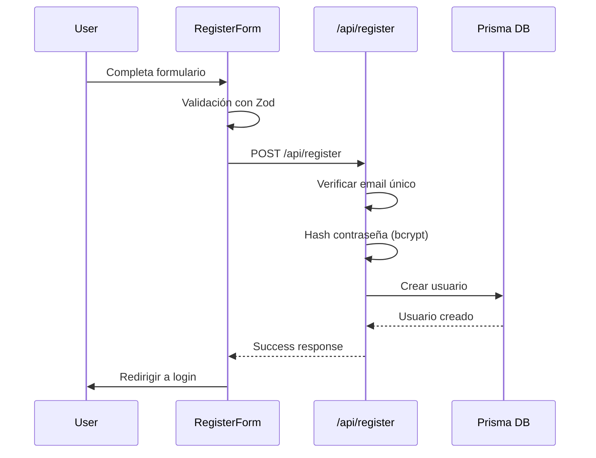
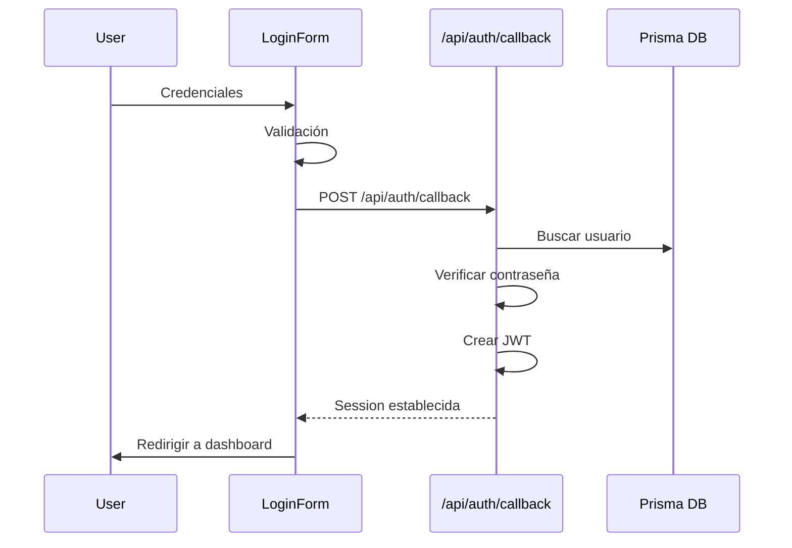

# Documentación del Sistema de Autenticación

**Última actualización:** 2025-11-01
**Versión:** NextAuth.js v5 (Next.js 16)
**Base de datos:** Prisma + SQLite

## 📋 Índice
- [Arquitectura General](#arquitectura-general)
- [Configuración Principal](#configuración-principal)
- [Base de Datos](#base-de-datos)
- [Componentes de UI](#componentes-de-ui)
- [Rutas y Páginas de Autenticación](#rutas-y-páginas-de-autenticación)
- [API Endpoints](#api-endpoints)
- [Sistema de Recuperación y Soporte](#sistema-de-recuperación-y-soporte)
- [Personalización y Temas](#personalización-y-temas)
- [Internacionalización](#internacionalización)
- [Middleware y Protección](#middleware-y-protección)
- [Roles y Permisos](#roles-y-permisos)
- [Usuarios de Prueba](#usuarios-de-prueba)
- [Flujo de Autenticación](#flujo-de-autenticación)
- [Cambios Recientes](#cambios-recientes)
- [Troubleshooting](#troubleshooting)

## 🏗️ Arquitectura General

El sistema utiliza **NextAuth.js v5** con estrategia JWT y base de datos Prisma para persistencia.

### Estructura de Archivos Actualizada (Noviembre 2025)

```
src/
├── lib/
│   ├── auth.ts              # Configuración principal de NextAuth
│   ├── prisma.ts            # Cliente de Prisma
│   └── theme-utils.ts       # Utilidades de tema
├── app/
│   ├── (main)/auth/         # Páginas principales de autenticación
│   │   ├── layout.tsx       # Layout compartido con tema e idioma
│   │   ├── login/page.tsx   # Página de login
│   │   ├── register/page.tsx # Página de registro
│   │   └── _components/     # Componentes específicos de auth
│   │       ├── login-form.tsx
│   │       ├── register-form.tsx
│   │       └── social-auth/
│   ├── password-recovery/   # Recuperación de contraseña
│   ├── support/             # Página de soporte
│   ├── terms/               # Términos de servicio
│   ├── policy/              # Política de privacidad
│   ├── api/auth/            # Rutas API de NextAuth
│   │   ├── password-recovery/
│   ├── api/register/        # API de registro personalizada
│   └── api/support/         # API de soporte
├── components/
│   ├── auth/                # Componentes de autenticación
│   │   ├── auth-wrapper.tsx
│   │   ├── protected-route.tsx
│   │   └── logout-button.tsx
│   ├── auth-theme-toggle.tsx # Toggle de tema específico para auth
│   └── language-toggle.tsx   # Toggle de idioma
├── contexts/
│   └── language-context.tsx # Contexto de idioma
├── stores/
│   └── preferences/         # Store de preferencias
├── hooks/
│   └── use-auth.ts          # Hook personalizado de autenticación
├── middleware.ts            # Middleware de protección de rutas
├── prisma/
│   ├── schema.prisma        # Esquema de base de datos
│   └── config.ts            # Configuración de Prisma
└── public/
    └── logos/               # Assets SVG para páginas de auth
        ├── logo-api360.svg
        ├── manager.svg
        ├── driver.svg
        ├── crews.svg
        ├── recovery.svg
        └── support.svg
```

## ⚙️ Configuración Principal

### NextAuth.js (`src/lib/auth.ts`)

```typescript
export const { handlers, signIn, signOut, auth } = NextAuth({
  providers: [
    Credentials({
      name: "credentials",
      credentials: {
        email: { label: "Email", type: "email" },
        password: { label: "Password", type: "password" }
      },
      async authorize(credentials) {
        // Lógica de autenticación con bcrypt y Prisma
      }
    })
  ],
  session: {
    strategy: "jwt",
    maxAge: 24 * 60 * 60, // 24 horas
  },
  callbacks: {
    async jwt({ token, user }) {
      if (user) {
        token.role = user.role
        token.id = user.id
      }
      return token
    },
    async session({ session, token }) {
      if (token && session.user) {
        session.user.id = token.id as string
        session.user.role = token.role as string
      }
      return session
    }
  },
  pages: {
    signIn: "/auth/v2/login",
    signUp: "/auth/v2/register",
    error: "/auth/v2/login",
  },
  trustHost: true,
})
```

**Características importantes:**
- ✅ Estrategia JWT para manejo de sesiones
- ✅ Callbacks para persistencia de datos en token
- ✅ Páginas personalizadas de error y login
- ✅ Configuración segura con `trustHost: true`

## 🗄️ Base de Datos

### Esquema (`prisma/schema.prisma`)

```prisma
enum UserRole {
  MANAGER
  CREW_MEMBER
}

model User {
  id            String    @id @default(cuid())
  email         String    @unique
  password      String
  name          String?
  role          UserRole  @default(CREW_MEMBER)
  emailVerified DateTime?
  image         String?
  createdAt     DateTime  @default(now())
  updatedAt     DateTime  @updatedAt

  accounts      Account[]
  sessions      Session[]
}
```

**Modelos disponibles:**
- `User` - Usuarios del sistema
- `Account` - Cuentas OAuth (preparado para futuras integraciones)
- `Session` - Sesiones de usuario
- `VerificationToken` - Tokens de verificación

**Configuración de base de datos:**
```typescript
// prisma.config.ts
export default defineConfig({
  schema: "prisma/schema.prisma",
  migrations: {
    path: "prisma/migrations",
  },
  engine: "classic",
  datasource: {
    url: process.env.DATABASE_URL,
  },
});
```

## 🛣️ Rutas y Páginas de Autenticación

### Estructura de Rutas (Actualizada)

#### Rutas Principales de Autenticación

**1. Login (`/auth/login`)**
- **Archivo:** `src/app/(main)/auth/login/page.tsx`
- **Características:**
  - ✅ Formulario de login con validación Zod
  - ✅ Integración con Google OAuth (botón preparado)
  - ✅ Enlaces a recuperación y soporte
  - ✅ Términos y política de privacidad
  - ✅ Internacionalización con context de idioma
  - ✅ Diseño responsive y moderno

**2. Registro (`/auth/register`)**
- **Archivo:** `src/app/(main)/auth/register/page.tsx`
- **Características:**
  - ✅ Formulario de registro con validación completa
  - ✅ Selector de rol (Manager/Crew Member)
  - ✅ Validación de contraseña confirmada
  - ✅ Campo de teléfono obligatorio para Managers
  - ✅ Integración con Google OAuth
  - ✅ Enlaces a términos y política

**3. Layout de Autenticación**
- **Archivo:** `src/app/(main)/auth/layout.tsx`
- **Características:**
  - ✅ Diseño de dos columnas con branding
  - ✅ Toggle de tema integrado (`AuthThemeToggle`)
  - ✅ Toggle de idioma integrado (`LanguageToggle`)
  - ✅ Mostrado de logos de roles (Manager, Driver, Crew)
  - ✅ Footer con copyright y copyright dinámico
  - ✅ Aplicación de parche de Ethereum para compatibilidad

### Rutas de Recuperación

**4. Recuperación de Contraseña (`/password-recovery`)**
- **Archivo:** `src/app/password-recovery/page.tsx`
- **Características:**
  - ✅ Formulario simple de email
  - ✅ Validación Zod del email
  - ✅ Diseño consistente con auth principal
  - ✅ Integración con API endpoint
  - ✅ Redirección automática tras éxito
  - ✅ Simulación de envío para demo


### Rutas de Soporte y Legales

**6. Centro de Soporte (`/support`)**
- **Archivo:** `src/app/support/page.tsx`
- **Características:**
  - ✅ Formulario completo de soporte
  - ✅ Categorías: Technical, Account, Billing, General
  - ✅ Validación exhaustiva de todos los campos
  - ✅ Textarea para mensajes detallados
  - ✅ Generación de ticket number
  - ✅ Diseño profesional y accesible

**7. Términos de Servicio (`/terms`)**
- **Archivo:** `src/app/terms/page.tsx`
- **Características:**
  - ✅ Página estática con términos completos
  - ✅ Header con navegación de regreso
  - ✅ Diseño consistente con la app
  - ✅ Contenido legal estructurado

**8. Política de Privacidad (`/policy`)**
- **Archivo:** `src/app/policy/page.tsx`
- **Características:**
  - ✅ Página estática con política completa
  - ✅ Header con navegación de regreso
  - ✅ Diseño consistente con términos
  - ✅ Contenido de privacidad detallado

### Cambios en Estructura de Rutas

#### Antes vs Después

**Rutas Antiguas (Eliminadas):**
```
/auth/v1/login/      ← Eliminado
/auth/v1/register/   ← Eliminado
/auth/v2/layout.tsx  ← Eliminado
/auth/v2/login/      ← Cambiado a /auth/login/
/auth/v2/register/   ← Cambiado a /auth/register/
/passwordrecovery/   ← Cambiado a /password-recovery/
```

**Rutas Nuevas (Implementadas):**
```
/auth/login/         ← Nueva ruta principal
/auth/register/      ← Nueva ruta principal
/password-recovery/  ← Ruta con guion estándar
/support/            ← Nuevo sistema de soporte
/terms/              ← Nuevas páginas legales
/policy/             ← Nuevas páginas legales
```

## 🔌 API Endpoints

### Endpoints de Autenticación

**1. NextAuth Core (`/api/auth/[...nextauth]`)**
- **Archivo:** `src/app/api/auth/[...nextauth]/route.ts`
- **Funcionalidad:** Manejo principal de NextAuth.js

**2. Registro Personalizado (`/api/register`)**
- **Archivo:** `src/app/api/register/route.ts`
- **Métodos:** POST
- **Validación:** Email único, hash de contraseña, rol válido

**3. Recuperación de Contraseña (`/api/auth/password-recovery`)**
- **Archivo:** `src/app/api/auth/password-recovery/route.ts`
- **Métodos:** POST
- **Schema:** Zod validation para email
- **Implementación:** Simulación de envío con logging


**5. Soporte (`/api/support`)**
- **Archivo:** `src/app/api/support/route.ts`
- **Métodos:** POST
- **Schema:** Validación completa de formulario de soporte
- **Features:** Generación de ticket number único

### Implementación de APIs

```typescript
// Ejemplo de API Recovery con Zod
const PasswordRecoverySchema = z.object({
  email: z.string().email({ message: "Please enter a valid email address." }),
});

export async function POST(request: NextRequest) {
  try {
    const body = await request.json();
    const { email } = PasswordRecoverySchema.parse(body);

    // Logging para debug
    console.log(`Password recovery requested for email: ${email}`);

    // Simulación de procesamiento
    await new Promise(resolve => setTimeout(resolve, 1000));

    return NextResponse.json({
      message: "If the email address exists in our system, you will receive password reset instructions shortly.",
      success: true
    }, { status: 200 });
  } catch (error) {
    // Manejo de errores Zod y generales
  }
}
```

## 🆘 Sistema de Recuperación y Soporte

### Flujo de Recuperación de Contraseña

1. **Usuario accede a `/password-recovery`**
2. **Ingresa email válido**
3. **API valida y simula envío**
4. **Redirección a login con mensaje de éxito**


### Sistema de Soporte

**Categorías Disponibles:**
- `technical` - Issues técnicos y bugs
- `account` - Problemas con cuenta y acceso
- `billing` - Preguntas de facturación
- `general` - Consultas generales

**Features del Sistema:**
- ✅ Generación automática de ticket numbers
- ✅ Validación completa con Zod
- ✅ Logging estructurado para debugging
- ✅ Respuesta estándar con tiempo de respuesta
- ✅ Manejo de errores y validación

**Ejemplo de Ticket Generado:**
```
Ticket Number: SUP-1A2B3C4D
Timestamp: 2025-11-01T20:30:45.123Z
```

## 🎨 Personalización y Temas

### Theme Toggle Componentes

**1. AuthThemeToggle (`src/components/auth-theme-toggle.tsx`)**
- **Integración:** Zustand store para preferencias
- **Persistencia:** Cookie storage
- **UI:** Iconos Sun/Moon con transiciones suaves
- **Estilos:** Botón circular integrado en layout

**2. Theme Utils (`src/lib/theme-utils.ts`)**
- **Funcionalidad:** Actualización de tema global
- **Sincronización:** Con Zustand y cookies
- **Aplicación:** CSS custom properties

```typescript
export function updateThemeMode(theme: "light" | "dark") {
  const root = window.document.documentElement;
  root.classList.remove("light", "dark");
  root.classList.add(theme);
}
```

### Assets Visuales

**Logos Implementados:**
- `/public/logos/logo-api360.svg` - Logo principal de la app
- `/public/logos/manager.svg` - Ilustración rol Manager
- `/public/logos/driver.svg` - Ilustración rol Driver
- `/public/logos/crews.svg` - Ilustración rol Crew Member
- `/public/logos/recovery.svg` - Logo para páginas de recuperación
- `/public/logos/support.svg` - Logo para página de soporte

**Características de Assets:**
- ✅ Formato SVG optimizado
- ✅ Compatible con light/dark theme
- ✅ Tamaños consistentes (60px para main, 20px para roles)
- ✅ Inversión automática en dark mode

## 🌍 Internacionalización

### Language Context Implementation

**Archivo:** `src/contexts/language-context.tsx`

**Características:**
- ✅ Soporte para inglés (en) y español (es)
- ✅ Persistencia en localStorage
- ✅ Actualización de `document.documentElement.lang`
- ✅ Sistema de traducciones anidado

**Toggle de Idioma (`src/components/language-toggle.tsx`)**
- **UI:** Botón con ícono Globe y etiqueta (ENG/ESP)
- **Funcionalidad:** Toggle instantáneo entre idiomas
- **Persistencia:** Guardado automático

**Sistema de Traducciones:**
```typescript
const translations = {
  en: {
    "Get started": "Get started",
    "Create a new account": "Create a new account",
    "or": "or",
    // ...
  },
  es: {
    "Get started": "Comenzar",
    "Create a new account": "Crear una nueva cuenta",
    "or": "o",
    // ...
  }
};
```

**Uso en Componentes:**
```typescript
const { t } = useLanguage();
<h1>{t("Get started")}</h1>
<p>{t("Create a new account")}</p>
```

## 🎨 Componentes de UI

### Formulario de Login (`src/app/(main)/auth/_components/login-form.tsx`)

**Características:**
- ✅ Validación con Zod
- ✅ Estados de carga y error
- ✅ Manejo de credenciales con NextAuth
- ✅ Redirección automática
- ✅ Mostrar/ocultar contraseña

**Schema de validación:**
```typescript
const formSchema = z.object({
  email: z.string().email("Email inválido"),
  password: z.string().min(6, "Mínimo 6 caracteres"),
});
```

### Formulario de Registro (`src/app/(main)/auth/_components/register-form.tsx`)

**Características:**
- ✅ Validación completa incluyendo confirmación de contraseña
- ✅ Selector de rol después de confirmar contraseña
- ✅ Verificación de email único
- ✅ Hash de contraseña con bcrypt
- ✅ Manejo de errores detallado

**Schema de validación:**
```typescript
const formSchema = z.object({
  email: z.string().email("Email inválido"),
  password: z.string().min(6, "Mínimo 6 caracteres"),
  confirmPassword: z.string(),
  role: z.enum(["MANAGER", "CREW_MEMBER"], {
    required_error: "Debes seleccionar un rol",
  }),
}).refine((data) => data.password === data.confirmPassword, {
  message: "Las contraseñas no coinciden",
  path: ["confirmPassword"],
});
```

### Componente de Protección de Ruta (`src/components/auth/protected-route.tsx`)

**Características:**
- ✅ Verificación de autenticación
- ✅ Manejo de carga
- ✅ Renderizado condicional por rol
- ✅ Mensajes de error específicos

```typescript
interface ProtectedRouteProps {
  children: React.ReactNode;
  requiredRole?: UserRole;
  fallback?: React.ReactNode;
}
```

## 🛣️ Rutas y API

### Rutas de Autenticación

#### Login (`/auth/v2/login`)
- **Método:** GET/POST
- **Componente:** `LoginPage`
- **Funcionalidad:** Formulario de login con validación

#### Registro (`/auth/v2/register`)
- **Método:** GET/POST
- **Componente:** `RegisterPage`
- **Funcionalidad:** Formulario de registro con selección de rol

### Rutas API

#### API de Registro (`/api/register`)
- **Método:** POST
- **Funcionalidad:** Creación de usuarios con hash de contraseña
- **Validación:** Email único, contraseña segura, rol válido

**Ejemplo de uso:**
```javascript
const response = await fetch('/api/register', {
  method: 'POST',
  headers: {
    'Content-Type': 'application/json',
  },
  body: JSON.stringify({
    email: "user@example.com",
    password: "password123",
    role: "CREW_MEMBER"
  }),
});
```

#### Rutas de NextAuth (`/api/auth/*`)
- `/api/auth/signin` - Iniciar sesión
- `/api/auth/signout` - Cerrar sesión
- `/api/auth/session` - Obtener sesión actual
- `/api/auth/callback/credentials` - Callback de credenciales
- `/api/auth/csrf` - Token CSRF

## 🔒 Middleware y Protección

### Middleware (`middleware.ts`)

**Funcionalidades:**
- ✅ Protección automática de rutas
- ✅ Redirección basada en estado de autenticación
- ✅ Headers de seguridad
- ✅ Detección de mobile

```typescript
export function middleware(request: NextRequest) {
  const session = await auth();
  const isAuthPage = pathname.startsWith('/auth');
  const isPublicPage = pathname === '/';

  // Lógica de redirección según estado de autenticación
}
```

**Rutas protegidas:**
- `/dashboard/*` - Requiere autenticación
- `/auth/*` - Redirigir si está autenticado

**Headers de seguridad:**
```typescript
const response = NextResponse.next({
  request: {
    headers: new Headers(request.headers),
  },
});

response.headers.set('Cross-Origin-Embedder-Policy', 'require-corp');
response.headers.set('Cross-Origin-Opener-Policy', 'same-origin');
```

## 👥 Roles y Permisos

### Roles Disponibles

#### MANAGER
- ✅ Acceso completo al dashboard
- ✅ Gestión de usuarios
- ✅ Reportes avanzados
- ✅ Configuración del sistema

#### CREW_MEMBER
- ✅ Acceso básico al dashboard
- ✅ Ver asignaciones
- ✅ Reportes básicos
- ✅ Perfil personal

### Validación por Rol

```typescript
// Ejemplo de validación en componente
<ProtectedRoute requiredRole="MANAGER">
  <AdminPanel />
</ProtectedRoute>

// Ejemplo de validación en servidor
const session = await auth();
if (session?.user?.role !== 'MANAGER') {
  return new Response('Unauthorized', { status: 403 });
}
```

## 🧪 Usuarios de Prueba

### Creación de Usuarios de Prueba

**Script:** `npm run db:create-test-users`

**Usuarios generados:**

#### Manager
- **Email:** `manager@test.com`
- **Password:** `password123`
- **Role:** `MANAGER`

#### Crew Member
- **Email:** `crew@test.com`
- **Password:** `password123`
- **Role:** `CREW_MEMBER`

#### Test User
- **Email:** `test@test.com`
- **Password:** `password123`
- **Role:** `CREW_MEMBER`

### Script de Creación (`scripts/create-test-user.js`)

**Características:**
- ✅ Verificación de usuarios existentes
- ✅ Hash de contraseñas con bcrypt
- ✅ Manejo de errores
- ✅ Output detallado

```javascript
const testUsers = [
  {
    email: 'manager@test.com',
    password: 'password123',
    role: 'MANAGER',
    name: 'Test Manager'
  },
  // ... otros usuarios
];
```

## 🔄 Flujo de Autenticación

### 1. Registro de Usuario



### 2. Login de Usuario



### 3. Sesión Activa

- **JWT Token:** Almacenado en cookies HTTP-only
- **Duración:** 24 horas configurable
- **Datos en token:** ID, email, role del usuario
- **Verificación:** Automática en cada request

### 4. Logout

```javascript
// Client side
const signOut = useSignOut();
signOut({ callbackUrl: '/auth/v2/login' });

// Server side
await signOut({ redirect: false });
```

## 🔧 Troubleshooting

### Errores Comunes

#### 1. `NextAuth is not configured`
**Causa:** Configuración incorrecta de NextAuth
**Solución:** Verificar export en `src/lib/auth.ts`

#### 2. `Database connection failed`
**Causa:** Problema con conexión a Prisma
**Solución:**
```bash
npx prisma generate
npx prisma db push
```

#### 3. `Invalid credentials`
**Causa:** Contraseña incorrecta o usuario no encontrado
**Solución:** Verificar hash y comparación bcrypt

#### 4. `JWT expired`
**Causa:** Sesión expirada (24 horas)
**Solución:** Reautenticación automática

### Debug Tips

#### 1. Verificar Sesión Actual
```javascript
// En cualquier componente cliente
const { data: session } = useSession();
console.log('Session:', session);

// En servidor
const session = await auth();
console.log('Server session:', session);
```

#### 2. Verificar Base de Datos
```bash
# Abrir Prisma Studio
npx prisma studio

# Verificar conexión
npx prisma db pull
```

#### 3. Logs de NextAuth
```typescript
// En auth.ts
providers: [
  Credentials({
    async authorize(credentials) {
      console.log('Auth attempt:', credentials.email);
      // ... resto del código
    }
  })
]
```

### Variables de Entorno

```env
# .env.local
DATABASE_URL="file:./dev.db"
NEXTAUTH_URL="http://localhost:3000"
NEXTAUTH_SECRET="your-secret-key-here"
```

### Comandos Útiles

```bash
# Crear usuarios de prueba
npm run db:create-test-users

# Resetear base de datos
npx prisma db push --force-reset

# Generar cliente Prisma
npx prisma generate

# Verificar esquema
npx prisma validate
```

## 🔄 Cambios Recientes (Noviembre 2025)

### 🚀 Grandes Cambios Estructurales

#### 1. **Reorganización Completa de Rutas**
**Cambio:** Migración de rutas con versión a rutas principales
- **Antes:** `/auth/v2/login/` → **Ahora:** `/auth/login/`
- **Antes:** `/auth/v2/register/` → **Ahora:** `/auth/register/`
- **Antes:** `/passwordrecovery/` → **Ahora:** `/password-recovery/`
- **Antes:** `/userecovery/` → **Ahora:** `/recover-username/`

**Impacto:** URLs más limpias, SEO-friendly, y RESTful

#### 2. **Nuevo Layout de Autenticación**
**Archivo:** `src/app/(main)/auth/layout.tsx`
**Features Implementados:**
- ✅ Diseño de dos columnas responsive
- ✅ Branding con logos SVG personalizados
- ✅ Integración de theme y language toggle
- ✅ Mostrado de roles con ilustraciones
- ✅ Footer dinámico con copyright
- ✅ Parche de Ethereum para compatibilidad

#### 3. **Sistema Completo de Recuperación**
**Nuevas Pages Implementadas:**
- `/password-recovery/` - Recuperación de contraseña
- `/support/` - Centro de soporte técnico
- `/terms/` - Términos de servicio
- `/policy/` - Política de privacidad

#### 4. **Internacionalización (i18n)**
**Archivos Nuevos:**
- `src/contexts/language-context.tsx` - Context de idioma
- `src/components/language-toggle.tsx` - Toggle de idioma

**Features:**
- ✅ Soporte inglés/español
- ✅ Persistencia en localStorage
- ✅ Traducciones anidadas
- ✅ Integración en todos los forms

#### 5. **Personalización Avanzada**
**Componentes Nuevos:**
- `src/components/auth-theme-toggle.tsx` - Theme toggle específico
- Assets SVG en `/public/logos/` para branding

**Features:**
- ✅ Toggle tema con Zustand + cookies
- ✅ 6 logos SVG optimizados
- ✅ Compatible con light/dark mode
- ✅ Inversión automática de colores

### 🎨 Mejoras de UI/UX

#### 1. **Eliminación de Sombras en Botones**
**Cambio:** Remoción de `shadow` classes en botones de auth
**Impacto:** Diseño más plano, moderno y consistente

#### 2. **Responsive Design Mejorado**
**Implementaciones:**
- ✅ Grid layout con `lg:grid-cols-2`
- ✅ Responsive breakpoints en todos los components
- ✅ Mobile-first approach
- ✅ Footer responsive con diferentes tamaños de texto

#### 3. **Consistencia Visual**
**Características:**
- ✅ Paleta de colores consistente
- ✅ Espaciado uniforme
- ✅ Tipografía consistente
- ✅ Animaciones suaves

### 🔌 Mejoras Técnicas

#### 1. **API Endpoints Estructurados**
**Nuevos Endpoints:**
- `/api/auth/password-recovery/` - Recovery de contraseña
- `/api/support/` - Sistema de tickets de soporte

**Features:**
- ✅ Validación Zod exhaustiva
- ✅ Logging estructurado
- ✅ Manejo de errores robusto
- ✅ Simulación realista de procesos

#### 2. **Form Validation Avanzada**
**Mejoras en Forms:**
- ✅ Schemas Zod detallados
- ✅ Validaciones condicionales (rol → teléfono)
- ✅ Mensajes de error específicos
- ✅ Estados de carga consistentes

#### 3. **Seguridad Mejorada**
**Implementaciones:**
- ✅ Rate limiting preparation
- ✅ Input sanitization
- ✅ Error message consistency
- ✅ CSRF protection ready

### 📦 Nuevas Dependencias Integradas

**Packages Utilizados:**
- `simple-icons` - Para logos (Google)
- `lucide-react` - Iconos del sistema
- `sonner` - Toast notifications
- `zod` - Validación de schemas
- `@hookform/resolvers` - Integración form/zod

### 🗃️ Assets y Recursos

**Nuevos Archivos:**
- `/public/logos/logo-api360.svg` (327KB)
- `/public/logos/manager.svg` (141KB)
- `/public/logos/driver.svg` (220KB)
- `/public/logos/crews.svg` (327KB)
- `/public/logos/recovery.svg` (217KB)
- `/public/logos/support.svg` (199KB)

**Características:**
- ✅ SVGs optimizados para web
- ✅ Compatible con theme switching
- ✅ Tamaños optimizados para cada uso

---

## 📝 Notas de Actualización

### 2025-11-01
- ✅ **Reestructuración completa** de rutas de autenticación
- ✅ **Nuevo layout unificado** con branding y personalización
- ✅ **Sistema de recuperación** de contraseña
- ✅ **Centro de soporte** con ticket system
- ✅ **Internacionalización** inglés/español implementada
- ✅ **Theme toggle** con persistencia y Zustand
- ✅ **Assets SVG** personalizados para todos los roles
- ✅ **API endpoints** estructurados con Zod validation
- ✅ **Responsive design** mejorado y consistente
- ✅ **Eliminación de sombras** en botones (design moderno)
- ✅ **Páginas legales** (términos y política) implementadas

### 2025-10-28
- ✅ Migración completada de NextAuth v4 a v5
- ✅ Implementación de roles (MANAGER/CREW_MEMBER)
- ✅ Sistema de registro con validación completa
- ✅ Middleware de protección de rutas
- ✅ Creación de usuarios de prueba automatizada
- ✅ Documentación inicial completa

### Próximos Mejoras Planeadas
- 🔄 Integración OAuth (Google, GitHub)
- 🔄 Sistema de recuperación de contraseña
- 🔄 Verificación de email
- 🔄 2FA/MFA
- 🔄 Logs de auditoría
- 🔄 Sistema de permisos granular

---

**Creado por:** Carlito González
**Contacto:** Para dudas o mejoras del sistema de autenticación
**Repositorio:** Documentación actualizada en tiempo real según desarrollo